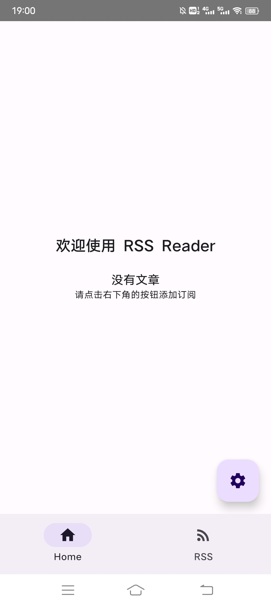
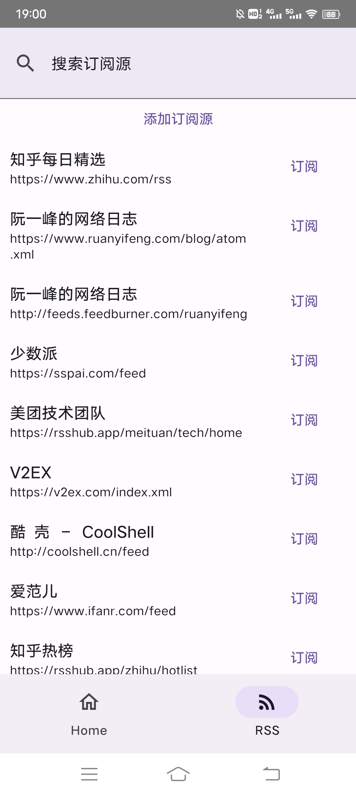
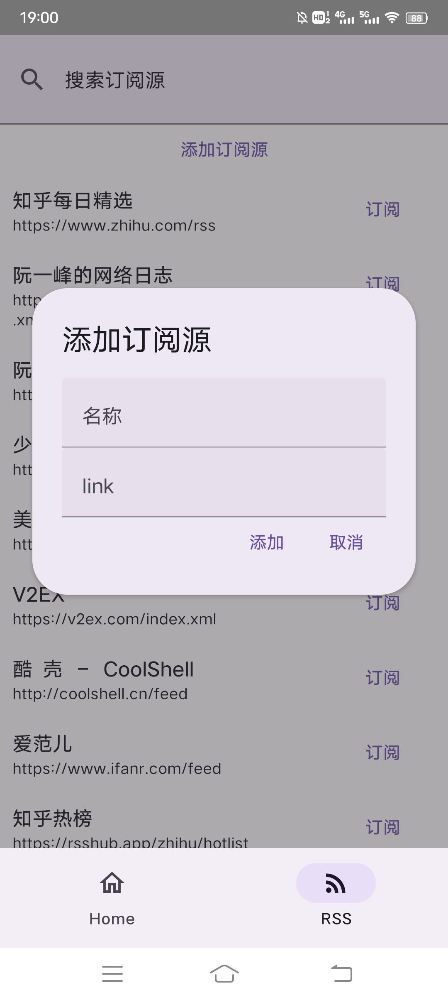
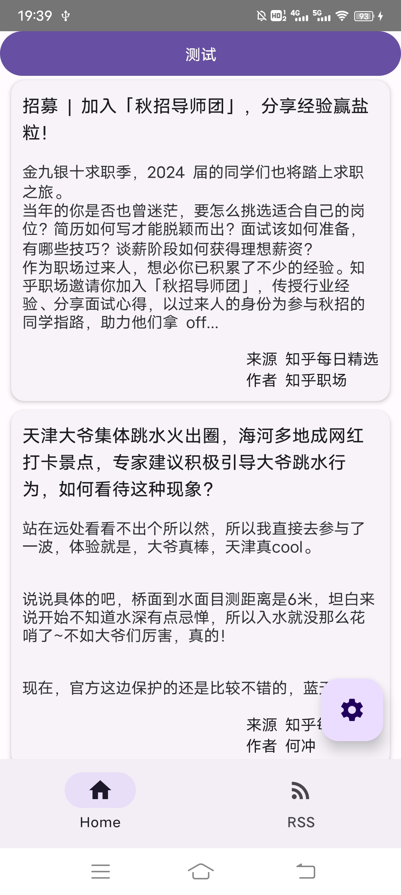
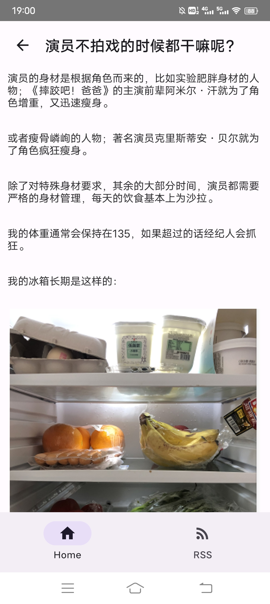
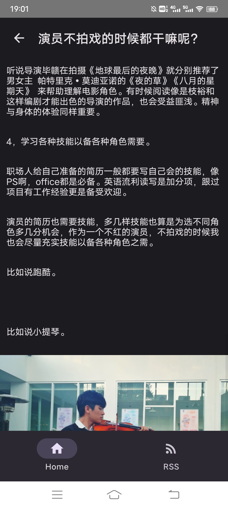

# RSS Reader 设计报告 

## 目录

1. [引言](#引言)
2. [技术栈](#技术栈)
3. [功能概述](#功能概述)
4. [界面展示](#界面展示)
5. [总结](#总结)

## 1. 引言
团队基于项目需求，设计并开发了RSS Reader应用。该应用旨在为用户提供一个便捷、个性化的RSS阅读体验，帮助他们轻松获取和阅读自己感兴趣的内容。

## 2. 技术栈
- 前端开发：使用React Native框架进行前端开发，结合React Native Paper组件库实现界面设计和用户交互。
- 后端开发：采用Spring Boot框架进行后端开发，提供API接口和数据处理逻辑。
- 数据库：使用MySQL作为应用的持久化数据存储，存储用户的订阅源信息。
- 爬虫：使用Python编写爬虫脚本，用于从指定的RSS源获取文章信息，并将数据存储到数据库中。
- 部署：前后端项目均基于Gradle构建。后端部署在Ubuntu 20.04上，并使用JDK 17运行后端服务。

## 3. 功能概述
RSS Reader应用提供以下核心功能：

- 订阅源管理：用户可以浏览和选择不同的订阅源，订阅自己感兴趣的内容，并进行订阅源的管理，包括添加、删除和搜索订阅源。
- 文章阅读：用户可以在应用中浏览已订阅的订阅源中的文章，并提供文章的标题、摘要和发布时间等信息。用户可以点击文章以查看完整内容，并可以标记文章为已读或未读状态。
- 搜索文章：用户可以使用关键词搜索文章内容，以快速找到感兴趣的文章。
- 主题切换：应用提供不同的主题模式，用户可以根据自己的喜好选择日间模式或夜间模式。

## 4. 界面展示
首页

订阅源管理

添加订阅源

文章预览

文章详情

夜间模式

## 5. 总结
本次项目开发过程中，团队成员充分发挥各自的优势，共同完成了RSS Reader应用的开发。在开发过程中，团队成员积极沟通，及时解决问题，保证了项目的进度和质量。通过本次项目开发，团队成员不仅学习到了新的技术，还提升了团队协作和项目管理的能力，为今后的工作打下了坚实的基础。